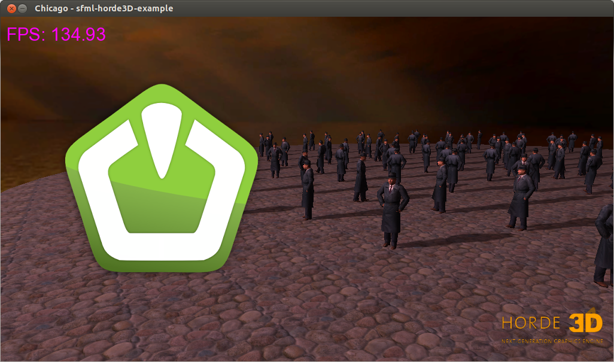

SFML + Horde3D Example
===============================

This example show how to integrate Horde3D with SFML. This is the classic 
Horde3D chicago example with a 2D overlay rendered by SFML (fps text and 
sfml logo).

[](screenshots/Working.png)

What would you want to do that?
====================================

There are a couple of reason for using a combination of Horde3D and SFML:
  - you might want to add some 3D to an exisiting 2D game engine based on SFML
  - you might want a more user friendly 2D module that you already now
  - etc...

Compilation
=================

You first need compile and install [Horde3D](http://horde3d.org/) and this [SFML fork](https://github.com/ColinDuquesnoy/SFML)
SFML (this fork fix a bug with texture 
units. If you don't use this fork, texture won't show up).


Then you can run the usual cmake/make commands:

```bash
cmake .
make
```

You will find the final binary in the bin folder at the root of the source 
directory.

License
==========

The source code is released under public domain.

